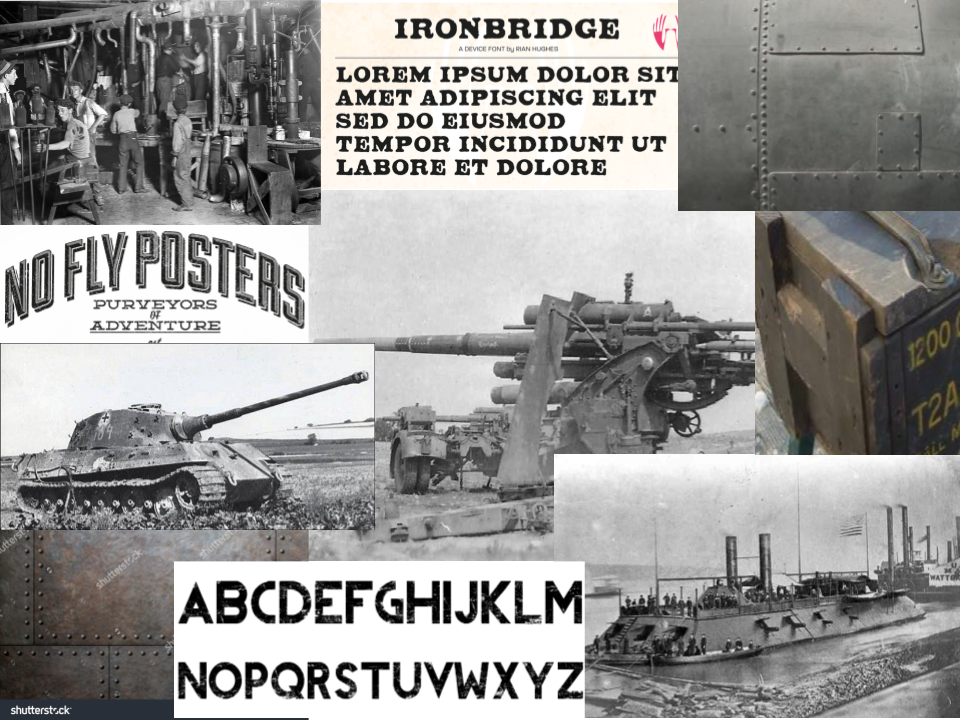

A moodboard that tries to capture the industrial aspect of WW2. Emphasis on strong fonts, and textures of riveted metal and aged wood.
 
The color scheme is muted and mostly metal-grey, with dark browns for the wood texture.

